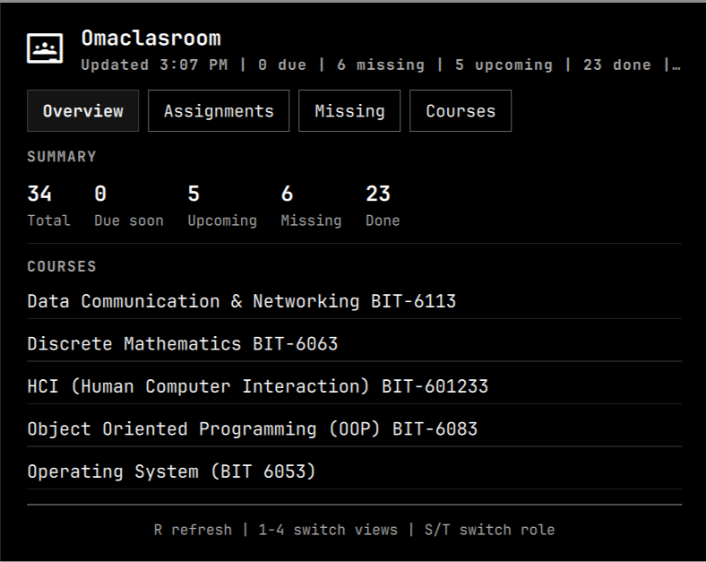
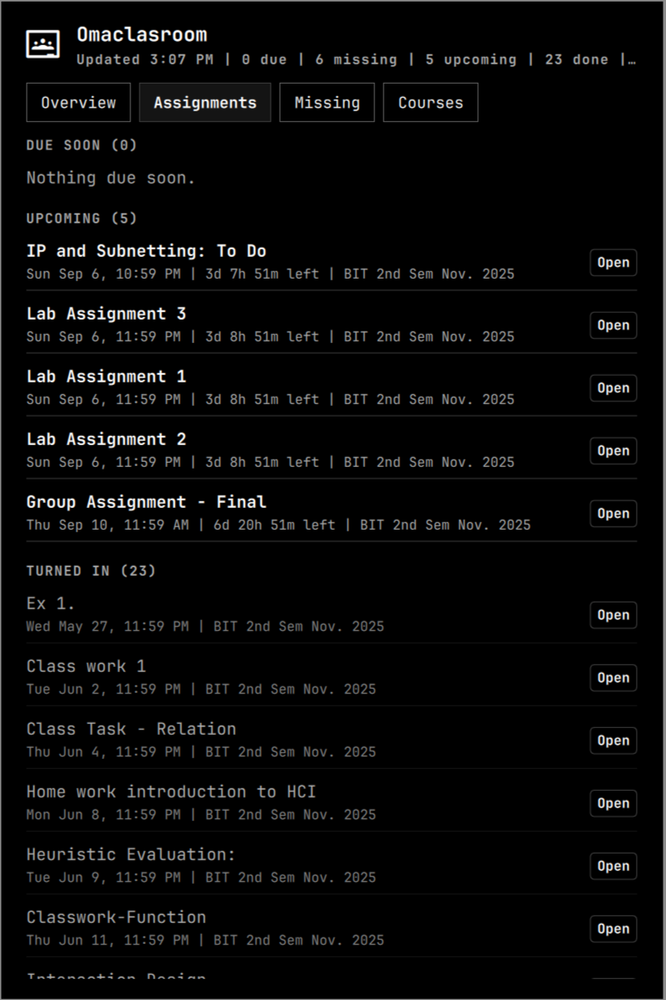
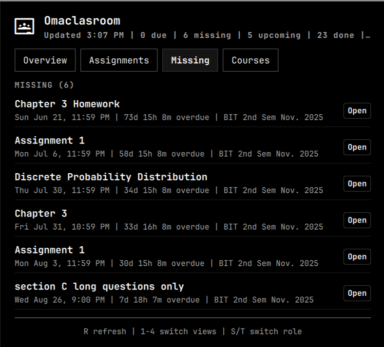
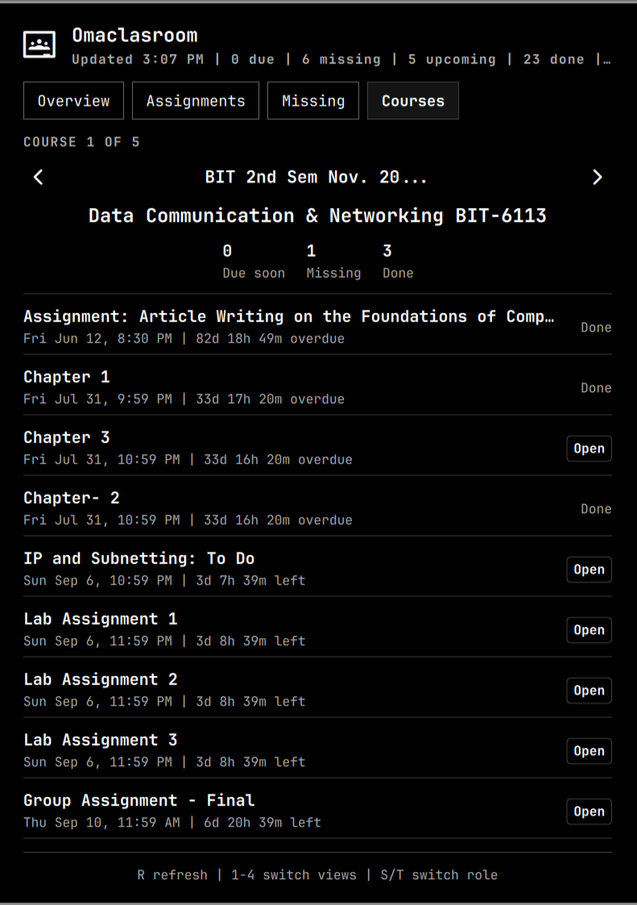

# Omaclasroom

**Google Classroom in your Omarchy bar.** Stop alt-tabbing to check assignments.

Built for students using [Chris Titus Tech](https://christitus.com/)'s Omarchy setup.






---

## Install

```sh
omarchy pkg add libsecret
omarchy plugin add https://github.com/tngyema/omaclasroom.git --enable
```

Set up Google auth:

```sh
~/.config/omarchy/plugins/io.github.omaclasroom/omaclasroom set-token \
  --client-id YOUR_CLIENT_ID \
  --client-secret YOUR_CLIENT_SECRET
```

Browser opens once. Token saves. Done forever.

---

## What You Get

- **Overview** — Grades, due counts, upcoming work
- **Assignments** — Everything sorted by due date
- **Courses** — Drill into individual classes
- **Missing** — Overdue stuff with one-click open
- **Auto Refresh** — Every 6 hours by default
- **Keyboard** — `1`-`4` views, `S`/`T` roles, `R` refresh

---

## Usage

| Action | How |
|--------|-----|
| Open/close | Left-click icon |
| Refresh | Right-click icon |
| Switch views | `1` `2` `3` `4` |
| Refresh | `R` |
| Close | `Escape` |

---

## Config

```sh
omarchy bar set io.github.omaclasroom days 21 --json
omarchy bar set io.github.omaclasroom refreshIntervalSec 10800 --json
```

| Setting | Default | Range |
|---------|---------|-------|
| `days` | 14 | 1–60 |
| `refreshIntervalSec` | 21600 | 300–86400 |

---

## Google Cloud Setup

1. [Google Cloud Console](https://console.cloud.google.com/)
2. Create/select project
3. Enable **Google Classroom API**
4. APIs & Services → Credentials
5. Create **OAuth 2.0 Client ID** (Desktop app)
6. Copy Client ID + Secret

---

## How Auth Works

One-time browser consent → refresh token saved to keyring → silent access token refreshes.

No browser popups after setup. Token persists across reboots.

**Re-authorize when:** You run `omaclasroom clear-token`, revoke in [Google permissions](https://myaccount.google.com/permissions), or after ~6 months of non-use.

---

## Remove

```sh
omarchy plugin remove io.github.omaclasroom
```

---

## Privacy

- HTTPS to Google Classroom API only
- Credentials in system keyring (file fallback if no `libsecret`)
- File permissions `0600`
- No tracking, no logging, no data sent elsewhere

---

## Teacher Mode

**Coming soon.** Grading views, assignment management, student tracking.

---

## License

[MIT](LICENSE)
