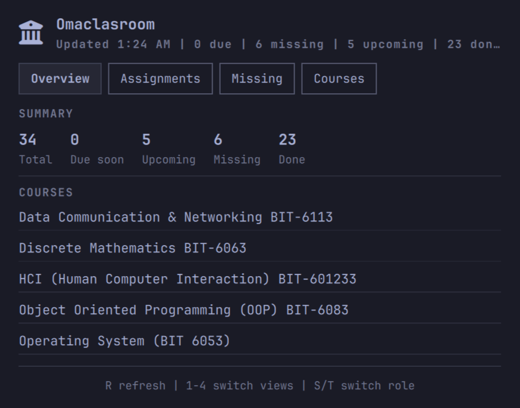

# Omaclasroom

[](LICENSE)
[](https://omarchy.org/)
[](https://www.python.org/)

Google Classroom grades, teacher deadlines, and upcoming assignments — right in your Omarchy bar.



---

## Quick Start

> **Requires Python 3.10+** and **`libsecret`** for credential storage.

Install the plugin and its dependency:

```sh
omarchy pkg add libsecret
omarchy plugin add https://github.com/tngyema/omaclasroom.git --enable
```

Then authorize with Google:

```sh
~/.config/omarchy/plugins/io.github.omaclasroom/omaclasroom set-token \
  --client-id YOUR_CLIENT_ID \
  --client-secret YOUR_CLIENT_SECRET
```

Your browser will open for Google authorization. After granting access, the token is saved securely in your system keyring.

---

## Features

| Feature | Description |
|---------|-------------|
| **Overview Panel** | Course grades, due counts, and next-up assignments at a glance |
| **Assignments View** | All upcoming work sorted by due date |
| **Courses View** | Per-course details and assignment lists |
| **Missing View** | Overdue assignments with one-click open |
| **Auto Refresh** | Configurable interval (default: 6 hours) |
| **OAuth2 Auth** | Secure token flow via local browser redirect |
| **Student + Teacher** | Automatically detects your role per course |
| **Keyboard Control** | Full navigation — `1`-`4` views, `S`/`T` roles, `R` refresh |

---

## Usage

| Action | Method |
|--------|--------|
| Open/close panel | Left-click the bar icon |
| Refresh data | Right-click the bar icon |
| Switch views | Press `1`, `2`, `3`, or `4` |
| Switch role | Press `S` or `T` |
| Refresh | Press `R` |
| Close panel | Press `Escape` |

---

## Configuration

```sh
# Change assignment window to 21 days
omarchy bar set io.github.omaclasroom days 21 --json

# Change refresh to every 3 hours
omarchy bar set io.github.omaclasroom refreshIntervalSec 10800 --json
```

| Setting | Default | Range | Description |
|---------|---------|-------|-------------|
| `days` | 14 | 1–60 | Assignment window in days |
| `refreshIntervalSec` | 21600 | 300–86400 | Auto-refresh interval |

---

## Google Cloud Setup

1. Go to [Google Cloud Console](https://console.cloud.google.com/)
2. Create a project (or select existing)
3. Enable the **Google Classroom API**
4. Go to **APIs & Services → Credentials**
5. Create an **OAuth 2.0 Client ID** (Desktop app type)
6. Copy the **Client ID** and **Client Secret**

---

## Remove

```sh
omarchy plugin remove io.github.omaclasroom
```

---

## Privacy

- Sends authenticated HTTPS requests **only** to Google Classroom API
- Credentials stored in the **system keyring**, never written to config files
- No data is collected, logged, or sent elsewhere

---

## License

[MIT License](LICENSE)
